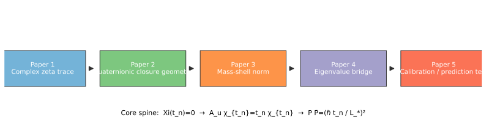

# Perfect Closure Paper Series

## Series Thesis

> **Perfect Closure is the condition where conjugate displacement resolves into a zero-residual, identity-return, or invariant norm. Across zeta zeros, quaternionic phase, and mass shells, the recurring structure is represented as an eigenvalue or kernel condition of a closure operator.**

### Central Synthesis

Zeta zeros may be interpreted as complex spectral traces of quaternionic Perfect Closure eigenmodes. When such eigenmodes are lifted into biquaternionic spacetime through a physical scale \(L_\ast\), they take the form of mass-shell norms. Thus, the Riemann critical line may be understood as a complex spectral slice of a broader quaternionic closure-mass-shell structure.

This is a research-program claim about formal structure. It is **not** a proof of the Riemann Hypothesis and **not** a derivation of known particle masses.

**One-line map:** zeta zero \(\to\) complex spectral trace \(\to\) quaternionic closure eigenmode \(\to\) mass-shell norm after scaling.

## Visual Guide

These figures are visual guides to the structure of the paper series. They are not additional claims.

*Figure: Series architecture across Papers 1–5, from complex trace to calibration tests. This supports the narrative ordering of the program and does not by itself establish any operator or physical result.*

*Figure: Core synthesis map \(\Xi(t_n)=0 \rightarrow \mathcal A_{\mathbf u}\chi_{t_n}=t_n\chi_{t_n} \rightarrow P\bar P=(\hbar t_n/L_\ast)^2\). This visual supports the shared-eigenvalue interpretation and does not claim RH or particle-mass derivation.*

*Figure: The same ordinate \(t_n\) appears as a complex spectral trace face \(\Xi(t_n)=0\) and a mass-shell face \(P\bar P=(\hbar t_n/L_\ast)^2\). This is an interpretive aid, not a proof claim.*

## Clean Spine

$$
\Xi(t_n)=0
\rightarrow
\mathcal A_{\mathbf u}\chi_{t_n}=t_n\chi_{t_n}
\rightarrow
P\bar P=\left(\frac{\hbar t_n}{L_\ast}\right)^2.
$$

Paper 1 identifies the complex spectral trace. Paper 2 lifts the trace into quaternionic closure geometry. Paper 3 defines the mass-shell norm. Paper 4 connects them through a shared eigenvalue. Paper 5 asks whether the scale \(L_\ast\) can be fixed well enough to make predictions.

## Completion Layer (supporting)

Perfect Closure can also be viewed in three layers:

$$
\text{phase} \rightarrow \text{completion} \rightarrow \text{norm},
$$
$$
p^{-q} \rightarrow ◎(q) \rightarrow P\bar P.
$$

This completion layer is supportive context for the series, not a separate proof mechanism.

## Current Series Order

### Paper 1 (entry / safest)
**Perfect Closure and Zeta Zeros: The Critical Line as a Square-Root Mirror**
- Markdown: [`papers/01-perfect-closure-and-zeta-zeros.md`](papers/01-perfect-closure-and-zeta-zeros.md)
- LaTeX: [`papers/01-perfect-closure-and-zeta-zeros.tex`](papers/01-perfect-closure-and-zeta-zeros.tex)

### Paper 2
**Perfect Closure Is Quaternionic: The Riemann Critical Line as a Complex Shadow**
- Markdown: [`papers/02-perfect-closure-is-quaternionic.md`](papers/02-perfect-closure-is-quaternionic.md)
- LaTeX: [`papers/02-perfect-closure-is-quaternionic.tex`](papers/02-perfect-closure-is-quaternionic.tex)

### Paper 3
**The Perfect Closure of the Mass Shell: Mass as Closed Quaternionic Light**
- Markdown: [`papers/03-perfect-closure-of-the-mass-shell.md`](papers/03-perfect-closure-of-the-mass-shell.md)
- LaTeX: [`papers/03-perfect-closure-of-the-mass-shell.tex`](papers/03-perfect-closure-of-the-mass-shell.tex)

### Paper 4
**The Zeta–Mass Closure Operator: Perfect Closure as an Eigenvalue Law**
- Markdown: [`papers/04-zeta-mass-closure-operator.md`](papers/04-zeta-mass-closure-operator.md)
- LaTeX: [`papers/04-zeta-mass-closure-operator.tex`](papers/04-zeta-mass-closure-operator.tex)

### Paper 5
**Closure Spectra and Physical Calibration: From Eigenvalues to Testable Mass Scales**
- Markdown: [`papers/05-closure-spectra-and-physical-calibration.md`](papers/05-closure-spectra-and-physical-calibration.md)
- LaTeX: [`papers/05-closure-spectra-and-physical-calibration.tex`](papers/05-closure-spectra-and-physical-calibration.tex)

## Supporting Documentation

- Glossary: [`docs/glossary.md`](docs/glossary.md)

## Future Separate Notes (not in the main sequence)

- [`future/pauli-exclusion-as-perfect-antisymmetric-closure.md`](future/pauli-exclusion-as-perfect-antisymmetric-closure.md)
- [`future/antimatter-as-conjugate-closure-direction.md`](future/antimatter-as-conjugate-closure-direction.md)
- [`future/faro-shuffle-as-finite-braid-closure.md`](future/faro-shuffle-as-finite-braid-closure.md)

## Important Disclaimer

This repository **does not claim to prove the Riemann Hypothesis**. The series presents a formalization framework and research program, with explicit non-claim boundaries in each paper.

## License

Written materials in this repository are released under the [Creative Commons Attribution 4.0 International (CC BY 4.0)](LICENSE) license.
