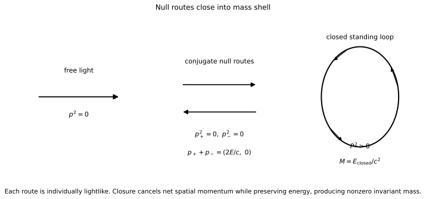

# Invariant Mass from Closed Lightlike Routes

## Purpose

This note gives the minimal standard-relativity bridge used in this repository:

\[
\text{free null light}
\rightarrow
\text{closed null routes with momentum cancellation}
\rightarrow
\text{nonzero invariant mass}.
\]

The point is structural and conservative. It does not replace QED/QM/relativity and it is not a full particle-construction theory.

## Single route: null invariant

For one free photon/lightlike phase route,

\[
p_\gamma^\mu p_{\gamma\mu}=0.
\]

So free propagation is null.

## Closed configuration: total four-momentum

For a closed set of lightlike routes,

\[
P_{\rm closed}^\mu=\sum_i p_i^\mu.
\]

The invariant mass of the total system is defined by

\[
M^2c^4
=
\left(\sum_i E_i\right)^2
-c^2\left|\sum_i\mathbf p_i\right|^2.
\]

Each route can remain individually lightlike while the total configuration has nonzero invariant norm.

## Closure condition

Under perfect directional closure,

\[
\sum_i \mathbf p_i=0,
\]

so the invariant relation reduces to

\[
Mc^2=\sum_i E_i.
\]

This is the central bridge:

> Each route is lightlike.  
> The closed system is massive because spatial momentum cancels while energy remains.

## Minimal two-route demonstration

Take two equal, opposite lightlike routes:

\[
p_+^\mu=\left(\frac{E}{c},+\mathbf p\right),\qquad
p_-^\mu=\left(\frac{E}{c},-\mathbf p\right).
\]

Each route is null:

\[
E^2-p^2c^2=0.
\]

Total four-momentum:

\[
P^\mu=p_+^\mu+p_-^\mu=\left(\frac{2E}{c},0\right).
\]

Therefore:

\[
M=\frac{2E}{c^2}.
\]

This is the cleanest "show, do not merely tell" form of the light-to-mass bridge.

*Each route is individually lightlike. Closure cancels net spatial momentum while preserving energy, producing nonzero invariant mass.*

## Position in this repository

Hydrogen shell locking is then introduced as the first calibrated shell architecture built on top of this relativistic closure bridge.
