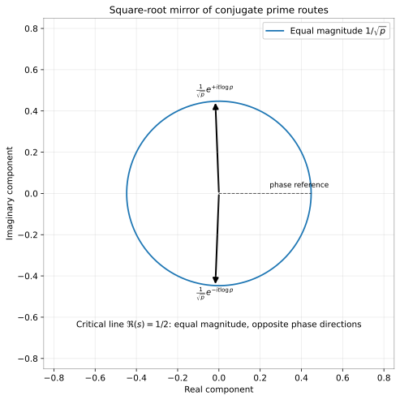
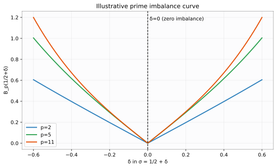

# Perfect Closure and Zeta Zeros: The Critical Line as a Square-Root Mirror

**John Van Geem / RQM Technologies**  
*Research Note — April 2026*

## Abstract

This entry paper defines Perfect Closure in the zeta setting and isolates the key local theorem: for each prime route, the critical line \(\operatorname{Re}(s)=1/2\) is the unique amplitude-balance line. We use
$$
p^{-s}=p^{-\sigma}e^{-it\log p}
$$
and the local imbalance
$$
B_p(\sigma)=\left|p^{-\sigma}-p^{-(1-\sigma)}\right|.
$$
The critical-line reduction gives
$$
B_p(1/2+\delta)=2p^{-1/2}|\sinh(\delta\log p)|,
$$
so \(B_p(\sigma)=0\) iff \(\sigma=1/2\). We then define
$$
\Xi(t)=\xi\!\left(\frac12+it\right),\qquad C(t)=|\Xi(t)|^2,
$$
and use \(\Xi(t_n)=0\) as the complex closure condition referenced by later papers. No proof of RH is claimed.

## Reader Guide

This paper answers one question: **what is the complex spectral trace?**  
The point of Paper 1 is not to locate the zeros. It is to identify what the later papers will call the complex spectral trace: a zero of the completed critical-line residual \(\Xi(t)\).

## 1. Perfect Closure in the zeta setting

A **Perfect Closure event** is the vanishing of a chosen closure residual built from zeta data.

- Local residual: prime-route imbalance \(B_p\).
- Global residual: completed critical-line magnitude \(C(t)=|\Xi(t)|^2\).

This is formal language for the series, not a replacement for analytic number theory.

## 2. Prime route and square-root balance

For prime \(p>1\) and \(s=\sigma+it\),
$$
p^{-s}=p^{-\sigma}e^{-it\log p}.
$$
On the critical line:
$$
p^{-(1/2+it)}=\frac1{\sqrt p}e^{-it\log p},
$$
and the conjugate route is
$$
p^{-(1/2-it)}=\frac1{\sqrt p}e^{+it\log p}.
$$
In plain language: the critical line is the balance line where conjugate prime-route amplitudes match.

*Figure: The square-root mirror. On the critical line, the two conjugate prime routes have equal magnitude \(1/\sqrt p\) and opposite phase direction, matching \(p^{-(1/2\pm it)}=(1/\sqrt p)e^{\mp it\log p}\). This visualizes local amplitude balance and does not imply that an individual prime cancels \(\zeta\).* 

## 3. Local imbalance theorem

Define
$$
B_p(\sigma)=\left|p^{-\sigma}-p^{-(1-\sigma)}\right|.
$$
Write \(\sigma=1/2+\delta\):
$$
B_p\!\left(\frac12+\delta\right)
=2p^{-1/2}|\sinh(\delta\log p)|.
$$

*Figure: Illustrative imbalance curves for \(B_p(1/2+\delta)=2p^{-1/2}|\sinh(\delta\log p)|\) at \(p=2,5,11\), with \(\delta=0\) marked as the zero-imbalance point. The chart supports Proposition 3.1 qualitatively and is not a numerical claim about zero locations.*

### Proposition 3.1
For every \(p>1\),
$$
B_p(\sigma)=0 \iff \sigma=\frac12.
$$

**Proof.** Since \(p^{-1/2}>0\),
\(B_p(1/2+\delta)=0\iff \sinh(\delta\log p)=0\).
Because \(\log p\neq0\) and \(\sinh x=0\iff x=0\), we get \(\delta=0\), i.e. \(\sigma=1/2\). The converse is immediate. \(\square\)

## 4. Optional finite-prime support

For a finite set \(p_1<\cdots<p_N\), define
$$
B_N(\sigma)^2=\sum_{j=1}^{N}B_{p_j}(\sigma)^2.
$$
Then \(B_N(\sigma)=0\) iff \(\sigma=1/2\), by Proposition 3.1 term-by-term. This finite result is supporting context, not the paper's main endpoint.

## 5. Prime-power echo (brief context)

In \(\operatorname{Re}(s)>1\),
$$
\log\zeta(s)=\sum_p\sum_{k\ge1}\frac{p^{-ks}}{k}.
$$
The \(k=1\) terms are primary prime routes and \(k\ge2\) terms are echo routes. We mention this only as bookkeeping context; the local imbalance theorem does not depend on this expansion.

## 6. Completed residual and complex spectral trace

Define
$$
\Xi(t)=\xi\!\left(\frac12+it\right),\qquad C(t)=|\Xi(t)|^2.
$$
The complex closure condition used later is
$$
\Xi(t_n)=0.
$$
This is the complex spectral trace condition that Papers 2–5 carry forward.

## 7. Non-claims and bridge

- No proof of RH.
- No claim of zero-location algorithm.
- No claim that a single prime route cancels \(\zeta\).

Bridge sentence: Paper 2 lifts the complex trace variable \(1/2+it\) into quaternionic slice geometry \(1/2+\mathbf u t\).

## References

1. B. Riemann, *Ueber die Anzahl der Primzahlen unter einer gegebenen Grösse* (1859).
2. E. C. Titchmarsh and D. R. Heath-Brown, *The Theory of the Riemann Zeta-Function*, 2nd ed., Oxford Univ. Press, 1986.
3. H. M. Edwards, *Riemann's Zeta Function*, Dover, 2001.
