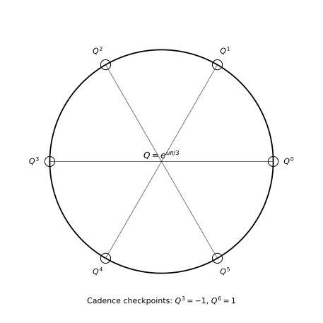

# Quaternionic Closure Slices: The Critical Line as a Complex Trace of Re(q)=1/2 Geometry

**John Van Geem / RQM Technologies**  
*Technical Manuscript - April 2026*

## Abstract

We lift the Paper 1 closure variable from the complex line to quaternionic slice geometry. For each unit imaginary quaternion \\(\mathbf u\\), we define an affine slice \\(q_{\mathbf u}(t)=1/2+\mathbf u t\\), with the classical critical line recovered as the \\(\mathbf u=i\\) slice. We distinguish this affine construction from unit-phase motion \\(Q=e^{\mathbf u\phi}\\), and we show that \\(\Re(Q)=1/2\\) yields the six-step cadence \\(Q^3=-1\\), \\(Q^6=1\\). We also define a slice lift of the completed residual and show a norm identity preserving scalar closure score across slices. This establishes geometric compatibility and does not imply a quaternionic proof of RH.

## Keywords

quaternions; critical line; slice geometry; perfect closure; six-step cadence; completed residual.

## 1. Introduction

Paper 1 established the local/global closure hierarchy on \\(\Re(s)=1/2\\). Paper 2 asks how that hierarchy behaves when orientation freedom is added. We define quaternionic slices so the same closure variable \\(t\\) can be expressed in a family of complex planes \\(\mathbb C_{\mathbf u}\\subset\mathbb H\\).

Our goal is not to replace complex analysis. Our goal is to show that the classical critical line can be read as one trace of a broader hyperslice \\(\Re(q)=1/2\\). This preserves continuity with standard zeta notation while preparing operator and mass-shell language in later papers.

## 2. Contributions

1. We define the quaternionic closure hyperslice \\(\Sigma_{1/2}=\{q\in\mathbb H:\Re(q)=1/2\}\\) and its affine traces \\(q_{\mathbf u}(t)=1/2+\mathbf u t\\).
2. We separate affine slice coordinates from unit-phase dynamics and explain why conflating them causes category errors.
3. We formalize the six-step closure cadence as geometric intuition, not a zeta-zero theorem.
4. We show the norm identity \\(\|\xi_{\mathbb H}(1/2+\mathbf u t)\|^2=|\Xi(t)|^2\\), preserving scalar closure score across slices.

## 3. Preliminaries and Mathematical Setup

Let \\(\mathbf u\\) be any unit imaginary quaternion with \\(\mathbf u^2=-1\\). Define
\\[
\mathbb C_{\mathbf u}=\{a+\mathbf u b:\,a,b\in\mathbb R\}.
\\]
Every \\(\mathbf u\\) defines a complex slice. The classical line \\(1/2+it\\) is recovered by choosing \\(\mathbf u=i\\).

Define the closure hyperslice
\\[
\Sigma_{1/2}=\{q\in\mathbb H:\Re(q)=1/2\},\qquad q_{\mathbf u}(t)=\frac12+\mathbf u t.
\\]
The first expression is a three-dimensional real hypersurface; the second is a one-dimensional affine trace within it.

*Figure 1. The classical critical line appears as the \\(\mathbf u=i\\) trace of the quaternionic family \\(q_{\mathbf u}(t)\\).* 

## 4. Formal Definitions and Propositions

We define two distinct objects:

- **Affine slice coordinate:** \\(q=1/2+\mathbf u t\\).
- **Unit phase:** \\(Q=e^{\mathbf u\phi}=\cos\phi+\mathbf u\sin\phi\\).

This separation matters: \\(t\\) indexes translated position, while \\(\phi\\) indexes unit-sphere rotation. We may relate them in models, but they are not identical by definition.

If \\(\Re(Q)=1/2\\), then \\(\cos\phi=1/2\\), so \\(\phi=\pi/3\\) modulo \\(2\pi\\). Therefore,
\\[
Q^3=e^{\mathbf u\pi}=-1,\qquad Q^6=e^{\mathbf u2\pi}=1.
\\]
This is the six-step closure cadence.

### Proposition 1 (Cadence interpretation)
The condition \\(\Re(Q)=1/2\\) implies a six-step unit-phase return, but does not imply \\(\Xi(t_n)=0\\).

**Reason.** The cadence is a group-geometric statement on unit quaternions. Zero conditions for \\(\Xi\\) are analytic statements for the completed zeta residual. They are compatible but distinct levels.

*Figure 2. Six-step cadence for \\(Q=e^{\mathbf u\pi/3}\\), illustrating \\(Q^3=-1\\), \\(Q^6=1\\).* 

## 5. Interpretation and Discussion

We now lift the prime-phase factor:
\\[
p^{-(1/2+it)}=p^{-1/2}e^{-it\log p}
\quad\leadsto\quad
p^{-(1/2+\mathbf u t)}=p^{-1/2}e^{-\mathbf u t\log p}.
\\]
Amplitude remains \\(p^{-1/2}\\); only orientation axis changes. This is why we describe the lift as conservative.

Let \\(\Xi(t)=\xi(1/2+it)\\), and define a slice packaging
\\[
\xi_{\mathbb H}(1/2+\mathbf u t)=\Re\Xi(t)+\mathbf u\Im\Xi(t).
\\]
Then
\\[
\|\xi_{\mathbb H}(1/2+\mathbf u t)\|^2=|\Xi(t)|^2.
\\]
This establishes that scalar closure score is slice-invariant under the chosen embedding. The result is structural compatibility, not additional zero production.

## 6. Scope and Limitations

- We do **not** claim quaternionic geometry replaces complex analysis.
- We do **not** claim the six-step cadence proves zeta-zero placement.
- We do **not** claim a full quaternionic analytic continuation theory for \\(\zeta\\).
- We do **not** claim mass predictions in this paper.

## 7. Conclusion

We defined quaternionic closure slices and showed that the classical critical line is one trace through \\(\Re(q)=1/2\\) geometry. We distinguished affine slicing from unit-phase dynamics and formalized six-step cadence as geometric intuition. We then showed norm preservation for the lifted residual, providing the exact compatibility structure needed for Paper 3 and the operator bridge in Paper 4.

## References

[1] W. R. Hamilton, *Elements of Quaternions*, 1866.  
[2] S. L. Adler, *Quaternionic Quantum Mechanics and Quantum Fields*, Oxford Univ. Press, 1995.  
[3] E. C. Titchmarsh and D. R. Heath-Brown, *The Theory of the Riemann Zeta-Function*, 2nd ed., 1986.
