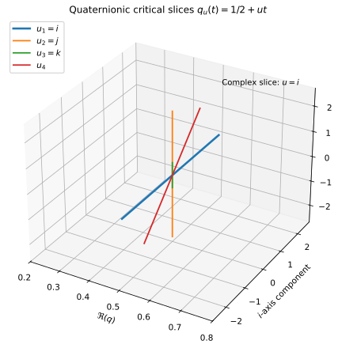

# The Quaternionic Lift of the Critical Line: Complex Planes at Every Slice

**John Van Geem / RQM Technologies**  
*Preprint - April 2026*

## Abstract

The quaternion algebra \(\mathbb H\) contains many embedded complex planes, one for each unit imaginary quaternion \(u\) with \(u^2=-1\). This paper explains how that geometric fact gives a conservative lift of the classical critical-line coordinate \(s=1/2+it\) into the family \(q_u(t)=1/2+ut\). The ordinary complex line is recovered by the special choice \(u=i\). We then package the completed residual by \(\xi_{\mathbb H}(1/2+ut)=\Re\Xi(t)+u\Im\Xi(t)\), where \(\Xi(t)=\xi(1/2+it)\), and prove norm preservation \(\|\xi_{\mathbb H}(1/2+ut)\|^2=|\Xi(t)|^2\). The construction does not introduce a new zeta function; it is a representation lift that preserves the scalar closure score while allowing many orientation axes.

## 1. Introduction

Paper 1 isolated a scalar closure variable \(\Xi(t)\) on the classical line \(1/2+it\). Paper 2 asks a geometric question: can we keep the same scalar parameter \(t\), keep the same closure score \(|\Xi(t)|\), and still represent the line in a larger algebraic space? The answer is yes, because quaternions have many imaginary directions.

The important point is that this lift is conservative. Complex analysis is not replaced. The usual complex plane is included as one slice inside a larger family.

## 2. Quaternionic preliminaries

A quaternion has the form
\[
q=a+b\mathbf i+c\mathbf j+d\mathbf k,
\]
with \(a,b,c,d\in\mathbb R\) and \(\mathbf i^2=\mathbf j^2=\mathbf k^2=\mathbf i\mathbf j\mathbf k=-1\).

### Definition 1 (Unit imaginary quaternion)
A quaternion \(u\in\mathbb H\) is a unit imaginary quaternion if
\[
\Re(u)=0,\qquad \|u\|=1,\qquad u^2=-1.
\]

The reason for this definition is simple: such a unit behaves algebraically like the complex imaginary unit.

## 3. Complex planes inside \(\mathbb H\)

For each unit imaginary \(u\), define
\[
\mathbb C_u=\{a+ub:\ a,b\in\mathbb R\}.
\]

### Definition 2 (Complex slice)
The set \(\mathbb C_u\) is called the complex slice associated with \(u\).

### Proposition 1
For each unit imaginary \(u\), \(\mathbb C_u\) is algebraically isomorphic to \(\mathbb C\).

**Proof sketch.** Map \(a+ib\mapsto a+ub\). Addition is preserved termwise. Multiplication is preserved because the only required relation is the square of the imaginary unit, and both satisfy \(i^2=u^2=-1\). \(\square\)

This equation should be read as an embedding statement: each slice is a legitimate complex plane inside \(\mathbb H\).

## 4. The critical line as one slice

The classical coordinate is
\[
s=\frac12+it.
\]
In quaternionic language, this is the special slice \(u=i\).

### Proposition 2
Choosing \(u=i\) recovers the classical critical line exactly.

**Proof.** Substituting \(u=i\) into \(1/2+ut\) gives \(1/2+it\). No reparameterization is needed. \(\square\)

## 5. The quaternionic lift \(q_u(t)=1/2+ut\)

### Definition 3 (Quaternionic critical-line lift)
For unit imaginary \(u\), define
\[
q_u(t)=\frac12+ut,\qquad t\in\mathbb R.
\]

The scalar parameter \(t\) is preserved, while only orientation changes. That is why the lift is conservative rather than revolutionary. What this does not show is a new analytic theory of \(\zeta\); it shows a broader representation space for the same trace parameter.

*Figure 1. The classical line is one slice in a family of quaternionic complex planes.*

## 6. Slice packaging of the completed residual

Let
\[
\Xi(t)=\xi\!\left(\frac12+it\right).
\]
Define the slice package
\[
\xi_{\mathbb H}\!\left(\frac12+ut\right)=\Re\Xi(t)+u\Im\Xi(t).
\]

This construction preserves the real and imaginary components but assigns them to the chosen axis \(u\).

### Proposition 3
For every unit imaginary \(u\),
\[
\left\|\xi_{\mathbb H}\!\left(\frac12+ut\right)\right\|^2=|\Xi(t)|^2.
\]

**Proof.** For numbers of the form \(x+uy\) with \(u^2=-1\), the norm-square is \(x^2+y^2\). Here \(x=\Re\Xi(t)\), \(y=\Im\Xi(t)\), so the result follows immediately. \(\square\)

The important point is scalar invariance: closure magnitude is unchanged by the slice choice.

## 7. Relation to Perfect Closure

Paper 1 used \(C(t)=|\Xi(t)|^2\) as scalar closure score. The quaternionic packaging preserves this score for each \(u\), so the lift is compatible with the same closure criterion.

A secondary motif is six-step phase cadence. If \(Q=e^{u\pi/3}\), then \(Q^3=-1\) and \(Q^6=1\). This is useful geometric intuition, but it is not the main theorem of this paper.

## 8. Discussion

Quaternions allow many imaginary directions. Choosing one such direction gives a complex slice, and each slice carries the same \(t\)-parameterization. This offers a teacher-friendly interpretation: the same line can be seen from many internal orientations without changing scalar content.

The bridge becomes meaningful only when this restraint is respected: no new zeros are claimed, and no replacement of complex analysis is attempted.

## 9. Conclusion

The central result is representation-theoretic. The critical line \(1/2+it\) lifts to \(q_u(t)=1/2+ut\) across a family of complex slices in \(\mathbb H\). The classical plane is recovered at \(u=i\), and the packaged residual preserves scalar norm. This establishes the quaternionic language used in Papers 3 and 4 while keeping analytic claims conservative.

## 10. References

[1] W. R. Hamilton, *Elements of Quaternions*, 1866.  
[2] S. L. Adler, *Quaternionic Quantum Mechanics and Quantum Fields*, Oxford Univ. Press, 1995.  
[3] E. C. Titchmarsh and D. R. Heath-Brown, *The Theory of the Riemann Zeta-Function*, 2nd ed., Oxford Univ. Press, 1986.
