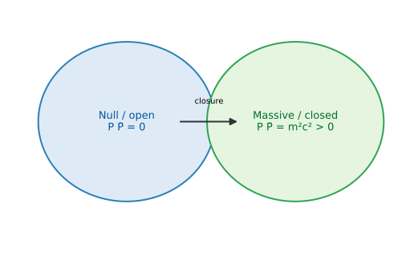

# The Perfect Closure of the Mass Shell: Mass as Closed Quaternionic Light

**John Van Geem / RQM Technologies**  
*Research Note — April 2026*

## Abstract

This paper defines the mass shell in quaternionic norm language. With biquaternionic momentum
$$
P=\frac{E}{c}+I\mathbf p,\qquad I^2=-1,
$$
the relativistic invariant becomes
$$
P\bar P=m^2c^2.
$$
Null modes satisfy \(P\bar P=0\); massive modes satisfy \(P\bar P>0\). We also record Compton curvature \(k_C=mc/\hbar\). The bridge to zeta is deferred to Paper 4.

## Reader Guide

This paper answers: **what is a mass shell in quaternionic norm language?**  
The bridge to zeta does not happen in this paper. This paper only prepares the mass-shell norm that Paper 4 will connect to the closure eigenvalue \(t_n\).

## 1. Relativistic mass shell

Standard form:
$$
E^2=p^2c^2+m^2c^4,
$$
equivalently
$$
\frac{E^2}{c^2}-|\mathbf p|^2=m^2c^2.
$$
This is the invariant relation we will rewrite in biquaternionic notation.

## 2. Biquaternionic momentum norm

Define
$$
P=\frac{E}{c}+I\mathbf p,
$$
where \(I\) commutes with \(i,j,k\) and \(\bar{\mathbf p}=-\mathbf p\). Then
$$
P\bar P=\left(\frac{E}{c}\right)^2-|\mathbf p|^2.
$$
So the mass shell is
$$
P\bar P=m^2c^2.
$$
This is the main identity of the paper.

## 3. Open/null and closed/massive interpretation

- \(P\bar P=0\): null/open propagation.
- \(P\bar P>0\): massive/closed invariant norm.

This interpretation is kinematic. It does not by itself provide particle-mass prediction.

*Figure: Conceptual split between null/open propagation \(P\bar P=0\) and massive/closed invariant norm \(P\bar P=m^2c^2>0\). It clarifies the interpretation of Section 3 and is not a full spacetime derivation.*

## 4. Compton curvature scale

Define
$$
\bar\lambda_C=\frac{\hbar}{mc},\qquad k_C=\frac{mc}{\hbar}=\bar\lambda_C^{-1}.
$$
Paper 4 will match this physical curvature scale to a lifted closure eigenvalue scale.

## 5. Non-claims and transition

- No derivation of known particle masses.
- No replacement of QFT.
- No Standard Model completion claim.

Transition sentence: Paper 4 is where the zeta spectral trace \(\Xi(t_n)=0\) and the mass-shell norm \(P\bar P=m^2c^2\) are connected through a shared closure eigenvalue.

## References

1. A. Einstein, *Zur Elektrodynamik bewegter Körper* (1905).
2. W. R. Hamilton, *Elements of Quaternions* (1866).
3. S. L. Adler, *Quaternionic Quantum Mechanics and Quantum Fields*, Oxford Univ. Press, 1995.
