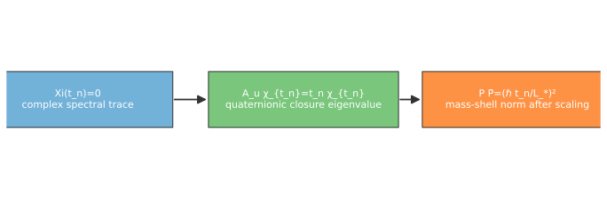
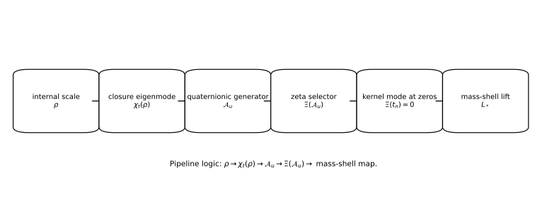
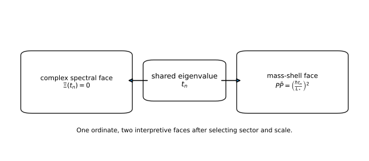

# The Zeta–Mass Closure Operator: Perfect Closure as an Eigenvalue Law

**John Van Geem / RQM Technologies**  
*Research Note — April 2026*

## Abstract

This paper gives the main synthesis of the series. The same value \(t_n\) appears in three aligned forms:
$$
\Xi(t_n)=0,
$$
$$
\mathcal A_{\mathbf u}\chi_t=t\chi_t,
$$
$$
P\bar P=\left(\frac{\hbar t_n}{L_\ast}\right)^2.
$$
So a zeta zero is read as a complex spectral trace of a quaternionic closure eigenvalue, while the mass shell is the physical norm realization after scale conversion by \(L_\ast\). This is a formal bridge, not a proof of RH and not a particle-mass derivation.

## Reader Guide

Paper 4 answers: **how does the same eigenvalue have a zeta face and a mass-shell face?**

*Figure: Main synthesis pipeline from complex spectral trace \(\Xi(t_n)=0\) to quaternionic closure eigenvalue \(\mathcal A_{\mathbf u}\chi_{t_n}=t_n\chi_{t_n}\) to mass-shell norm \(P\bar P=(\hbar t_n/L_\ast)^2\). It summarizes the bridge logic and does not by itself prove RH or derive observed masses.*

## 1. Internal scale operator and eigenmodes

Let \(\rho>0\) and define
$$
\mathcal A_{\mathbf u}=\mathbf u\left(\rho\frac{d}{d\rho}+\frac12\right),\qquad \mathbf u^2=-1.
$$
Take eigenmodes
$$
\chi_t(\rho)=\rho^{-1/2-\mathbf u t}.
$$
Then
$$
\mathcal A_{\mathbf u}\chi_t=t\chi_t.
$$
So \(t\) is the quaternionic closure eigenvalue.

*Figure: Operator bridge chain \(\rho \rightarrow \chi_t(\rho)=\rho^{-1/2-\mathbf u t} \rightarrow \mathcal A_{\mathbf u} \rightarrow \Xi(\mathcal A_{\mathbf u}) \rightarrow\) kernel mode at \(t_n\rightarrow\) mass-shell lift through \(L_\ast\). This supports the map in Sections 1-3 and is not a standalone proof.*

## 2. Complex zeta-slice condition and selector

Define
$$
\Xi(t)=\xi\!\left(\frac12+it\right).
$$
The complex spectral-trace condition is
$$
\Xi(t_n)=0.
$$
Now define the closure selector
$$
\mathcal Z_{\mathbf u}=\Xi(\mathcal A_{\mathbf u}).
$$
If \(\Xi(t_n)=0\), then
$$
\Xi(\mathcal A_{\mathbf u})\chi_{t_n}=0.
$$
This is the kernel statement connecting zeta-slice trace and quaternionic eigenmode.

## 3. Mass-shell norm realization after scaling

Take the physical norm relation
$$
P\bar P=m^2c^2.
$$
Introduce the closure-conversion scale \(L_\ast\) by \(\log\rho=\ell/L_\ast\). Matching closure curvature to Compton curvature gives
$$
m_n=\frac{\hbar}{cL_\ast}|t_n|,
$$
so equivalently
$$
P\bar P=\left(\frac{\hbar t_n}{L_\ast}\right)^2,
$$
and
$$
L_\ast=t_n\frac{\hbar}{mc}=t_n\bar\lambda_C.
$$

## 4. Complex Spectral Slices of Quaternionic Mass Shells

The central synthesis is that \(t_n\) has two faces. In the zeta sector, \(t_n\) appears through the complex residual \(\Xi(t_n)=0\). In the quaternionic sector, it appears as the eigenvalue of \(\mathcal A_{\mathbf u}\). In the physical sector, after the scale map \(L_\ast\), it appears as a mass-shell norm \(P\bar P=(\hbar t_n/L_\ast)^2\). Thus, zeta zeros may be interpreted as complex spectral traces of quaternionic closure eigenvalues, not as particles themselves.

*Figure: The same ordinate \(t_n\) read in two sectors: complex spectral face \(\Xi(t_n)=0\) and mass-shell face \(P\bar P=(\hbar t_n/L_\ast)^2\). The figure is interpretive guidance and does not claim that zeta zeros are particles or that RH is proven.*

The zeta zero is not the mass shell itself. It is the complex spectral trace of a closure eigenvalue. The mass shell is the physical norm realization after scale conversion.

## 5. Optional supporting mechanisms

### 5.1 Closure Cadence (optional)

For phase \(e^{-\mathbf u t_n\log\rho}\), one can define
$$
\Lambda_n=\frac{2\pi}{t_n},\qquad \Delta_n=\frac{\pi}{3t_n}.
$$
This is optional geometric cadence context and not part of the core operator bridge.

### 5.2 Completion layer inside \(\Xi\) (optional)

The completed zeta expression includes a Gamma factor:
$$
\xi(s)=\frac12 s(s-1)\pi^{-s/2}\Gamma(s/2)\zeta(s).
$$
This is a completion layer inside \(\Xi\). It supports the completed residual viewpoint, but it is not a separate main mechanism in the zeta-to-mass-shell bridge.

## 6. Non-claims and bridge to Paper 5

- No proof of RH.
- No claim that zeta zeros are particles.
- No derived universal \(L_\ast\) in this paper.
- No Standard Model mass derivation.

Paper 5 asks whether \(L_\ast\) can be fixed independently, or stabilizes across predeclared families, strongly enough to make predictions.

## References

1. E. C. Titchmarsh and D. R. Heath-Brown, *The Theory of the Riemann Zeta-Function*, 1986.
2. H. M. Edwards, *Riemann’s Zeta Function*, 2001.
3. S. L. Adler, *Quaternionic Quantum Mechanics and Quantum Fields*, 1995.
