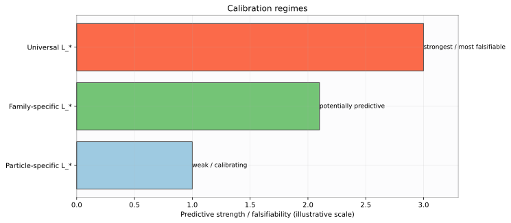
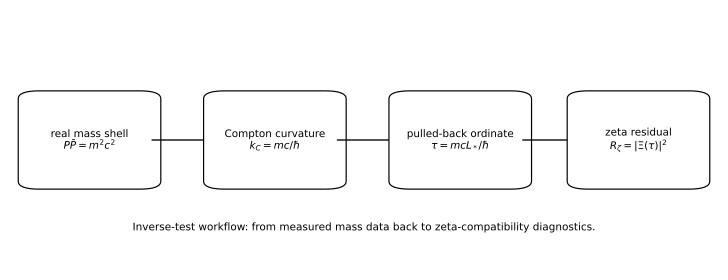

# Closure Spectra and Physical Calibration: From Eigenvalues to Testable Mass Scales

**John Van Geem / RQM Technologies**  
*Research Note - April 2026*

## Abstract

This paper sets the predictive standard for the zeta-to-mass-shell bridge. From Paper 4,
$$
m_n=\frac{\hbar}{cL_*}|t_n|,
$$
so predictive content depends on whether \(L_*\) is fixed independently or stabilizes across a predeclared physical family. To make that criterion operational, this paper defines resolved closure triples, calibration regimes, ratio tests, scale-stability tests, and falsification standards.

## 1. Introduction

This paper asks when the bridge becomes predictive rather than merely interpretable. The short answer is: only when the conversion scale is constrained before fitting. If \(L_*\) is allowed to float freely per datapoint, the map can remain descriptive but has little falsifiable power.

## 2. Contributions

1. We define a resolved closure triple across spectral, operator, and physical faces.
2. We classify calibration regimes by falsifiability strength.
3. We specify ratio tests and scale-stability diagnostics.
4. We state explicit falsification standards.

## 3. Core calibration relation

From the bridge equation
$$
\frac{t_n}{L_*}=\frac{mc}{\hbar},
$$
we solve for conversion length:
$$
L_*=t_n\frac{\hbar}{mc}=t_n\bar\lambda_C.
$$
This relation is central because it links three objects with different origins:

- \(t_n\): spectral ordinate from the closure trace,
- \(m\): physical mass measurement,
- \(L_*\): conversion scale between spectral and physical sectors.

If \(L_*\) is fixed in advance, the equation predicts \(m\) from \(t_n\). If \(m\) and \(t_n\) are both chosen post hoc and \(L_*\) is fitted afterward, predictive strength is weak.

The theory is therefore predictive only when \(L_*\) is independently fixed or demonstrably stable under predeclared assignment rules.

## 4. Resolved closure triple

A triple \((t_n,L_*,m_n)\) is resolved when all three faces of the same value are satisfied:

- \(\Xi(t_n)=0\),
- \(\mathcal A_{\mathbf u}\chi_{t_n}=t_n\chi_{t_n}\),
- \(P\bar P=m_n^2c^2=(\hbar t_n/L_*)^2\).

This definition enforces cross-domain consistency. It prevents using only one face of the framework while ignoring the others.

Interpretively:

- the first condition anchors spectral closure,
- the second anchors operator realization,
- the third anchors physical norm realization.

A resolved triple is still not a proof of uniqueness or ontology. It is a consistency checkpoint.

## 5. Calibration regimes

Three regimes have different predictive strength:

1. **Particle-specific \(L_*\)**: choose a separate \(L_*\) for each target. This usually has low falsifiability.
2. **Family-specific \(L_*\)**: one \(L_*\) per predeclared family. This can be meaningful if stability survives out-of-sample checks.
3. **Universal \(L_*\)**: one global \(L_*\) for all targets. This is strongest and most falsifiable.

*Figure: Calibration hierarchy from particle-specific \(L_\ast\) (weakest), to family-specific \(L_\ast\) (potentially predictive), to universal \(L_\ast\) (strongest and most falsifiable). This is a methodological guide, not a fit result.*

The regimes should be predeclared before numerical comparison. Changing regime definitions after seeing results weakens evidential value.

## 6. Ratio and scale-stability tests

If one \(L_*\) is shared in a family, then
$$
\frac{m_a}{m_b}\approx\frac{t_m}{t_n}.
$$
This equation removes \(L_*\) and tests internal proportionality. It is useful because it asks whether relative structure survives without direct scale tuning.

For assigned pairings, compute inferred scales:
$$
L_*(\text{particle},n)=\frac{\hbar t_n}{m_{\text{particle}}c}.
$$
A predictive family should show tight clustering of these inferred \(L_*\) values under rules fixed before fitting.

Recommended diagnostics include:

- within-family coefficient of variation of inferred \(L_*\),
- held-out prediction error when \(L_*\) is trained on one subset and tested on another,
- permutation checks against random reassignment baselines.

*Figure: Inverse test pipeline \(P\bar P=m^2c^2 \rightarrow k_C=mc/\hbar \rightarrow \tau=mcL_\ast/\hbar \rightarrow R_\zeta(m;L_\ast)=|\Xi(\tau)|^2\). This supports falsifiability workflow and does not imply that zeta zeros are particles.*

## 7. Falsification standards

The bridge fails as a predictive law in its present form if one or more of the following persist:

- no stable \(L_*\) appears in natural predeclared families,
- only post hoc assignments succeed,
- tolerance inflation is required to preserve apparent fits,
- out-of-sample predictive performance is absent.

These standards matter because they separate structural coherence from predictive content. A coherent map can still fail as a forecasting model.

## 8. Possible Future Selection Mechanism (supporting)

AGQF or dressed-factorial constructions may be studied as future candidate selection mechanisms, for example as node-gating prefactors that pre-screen candidate pairings. This remains optional support and is not required for the core zeta-to-mass-shell bridge.

Any such mechanism must be fixed before comparison and must not be used as an adjustable curve-fitting device. In other words, mechanism complexity is acceptable only if it increases out-of-sample predictive power under predeclared protocols.

## 9. Conclusion and Interpretive Boundaries

- No proof of RH.
- No claim that zeta zeros are particles.
- No established derivation of Standard Model masses.

Conclusion: the framework is structurally coherent across spectral, operator, and norm faces, but predictive status depends on independent or stable determination of \(L_*\). Paper 5 therefore treats calibration discipline as part of the theory itself, not as a secondary implementation detail.

## References

1. K. G. Wilson, "The renormalization group and critical phenomena," *Rev. Mod. Phys.* 55 (1983).
2. R. P. Feynman, *QED: The Strange Theory of Light and Matter*, Princeton Univ. Press, 1985.
3. S. L. Adler, *Quaternionic Quantum Mechanics and Quantum Fields*, Oxford Univ. Press, 1995.

